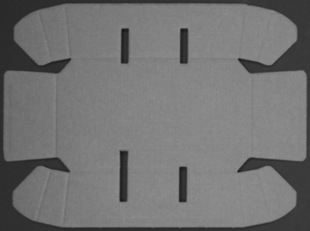
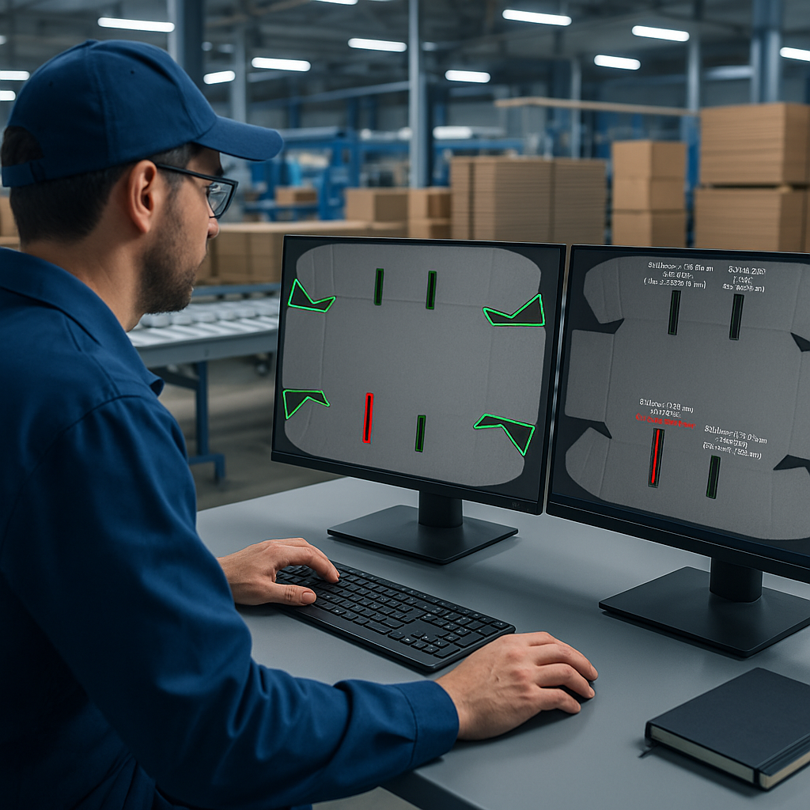

# Machine Vision for Symmetry Verification
Machine Vision System for Symmetry Verification in Cardboard Manufacturing Lines - Project for the course "Advanced Measurement Systems for Control Applications" at Politecnico di Milano

 ## 🚀 Project Summary
Group project for the course “Advanced Measurement Systems for Control Applications”.

• Developed a vision-based inspection system to assess the geometric symmetry of internal and external features on cardboard products, combining industrial hardware setup and custom Python algorithms.

• Designed and tuned the full acquisition setup, including a monochrome CMOS camera, IR-block filter, fixed-focus lens, and diffuse LED ring lighting, ensuring high-resolution and high-contrast images under variable ambient conditions.

• Calibrated the camera and corrected lens distortion using OpenCV tools, enabling precise pixel-to-mm conversion for feature localization.

• Implemented a robust preprocessing pipeline (Gaussian blur, Canny edge detection, morphological filtering, convex hull wrapping) to extract clean contours across a wide range of lighting scenarios.

• Built two complementary classification algorithms: the first detects internal features using minimum-area rectangles and compares their position, size, and orientation; the second extends symmetry verification to external shapes by leveraging spatial moments and centroid-based matching.

✅ The system operates without relying on predefined templates or golden samples, making it scalable and adaptable to different cardboard geometries and inspection requirements.

## 📁 Contents

➤ `run.py`: main script to execute the complete pipeline on a selected image, from calibration loading to final symmetry classification and visualization.

➤ `Pre_Processing.py`: core module for preprocessing (Gaussian blur, Canny edge detection, morphological operations), convex hull wrapping, and image alignment/cropping.

➤ `Symmetry_Via_Rectangles.py` & `Symmetry_Via_Moments.py`: two independent symmetry classification strategies based on shape descriptors and centroid analysis.

➤ `CaptureCalibrationImages.py` & `validation_calibration.py`: tools for image acquisition and validation during camera calibration.

➤ `Utils.py`: utility functions for configuration loading, CSV management, and symmetry axis handling.

➤ `canny.py`: interactive tuning interface for edge detection parameters with real-time feedback and export.

➤ `immagini/`: test images used in the project, organized as:
   • `setup_definitivo/`: raw images captured from the final acquisition setup.  
   • `aligned_cropped/`: preprocessed images ready for classification.

➤ `c_images/`: chessboard photos used for intrinsic camera calibration.  
➤ `calib_data/`: output calibration files (`.npz`) used for undistortion and metric mapping.  
➤ `sources/`: PDF references supporting design and theoretical justifications.  
➤ `Report.pdf`: technical documentation of the entire project (EN).

## ▶️ How to Run the Simulation
Run `run.py` and set the path to the desired image at the top of the script. The program will automatically load calibration data, apply the preprocessing pipeline, and perform symmetry classification.  

Final results and visualizations will be displayed and saved in the output directory.

## 📷 Results  
See `Report.pdf` for more details. In brief, the expected output to be provided to the company is:

| Raw image (+ allignment and cropping) | Expected visual output |
|--------------------------|------------------------|
|  |  |

## 🛠️ Technologies Used

- **Programming Language**: Python
- **Libraries & Tools**: OpenCV, NumPy, Matplotlib
- **Camera & Optics**: IDS UI-3360CP-M-GL (CMOS monochrome), Computar 12mm fixed-focus lens, IR-block filter  
- **Lighting**: LED ring light with external power supply  
- **Calibration Tools**: Checkerboard pattern, intrinsic calibration via OpenCV  

